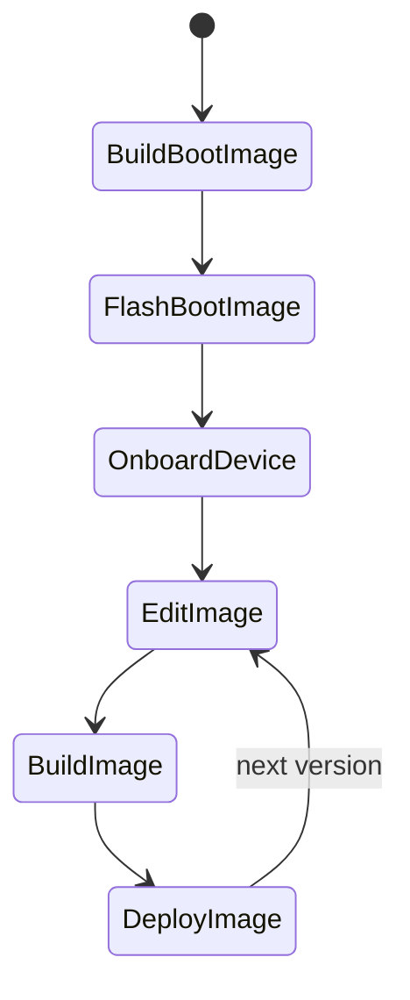

## Getting started

This project shows how to build custom Yocto images which can be deployed to devices.

Whilst the project can be modified to support your own setup, currently the project only includes the configuration required to deploy to the following devices:

* Raspberry Pi 3 and 4 (64 bit variants only)


### General project flow

Below describes the general workflow when using this project to build an image and to deploy the image to a device.

The project flow is as follows:



Where each step is described below:

|Step|Description|
-----|-----------|
|BuildBootImage|Build bootstrap image|
|FlashBootImage|Flash the bootstrap image to the device, e.g. flash the SD card (this is only required once!)|
|OnboardDevice|Register the device once to the cloud so you can enable Over-the-Air (OTA) updates|
|EditImage|Modify your image when new future requirements come up|
|BuildImage|Build a new image which includes the new changes|
|DeployImage|Deploy the image to the device using OTA update|


## Using the project

### Prelude

It is highly recommended to use **Ubuntu 20.04 LTS** for your build (host) machine. If you know what you are doing then you can use another linux distribution, however we cannot help you when things go wrong.

#### Minimum requirements

* At least 100 GB free disk space (however ~500GB is recommended as you don't want to run out and have to set all of this up again)
* x86_64 Machine if you have it, however arm64/aarch64 can also work 
* Lots of time (first build can take > 6 hours...welcome to the world of yocto)


### Installing the prerequisites

To start off, you will need to install the project and Yocto dependencies.

1. Clone the project and open a console at project's root directory

2. Install just (follow the instructions on the [justfile website](https://just.systems/man/en/chapter_5.html))

3. Install [kas](https://kas.readthedocs.io/en/latest/) (a tool used to managed yocto bitbake projects)

    ```sh
    pip3 install kas
    ```

4. Install the yocto dependencies

    **Ubuntu 20.04 LTS**

    ```
    sudo apt install file gawk wget git diffstat unzip texinfo gcc build-essential chrpath socat cpio python3 python3-pip python3-pexpect xz-utils debianutils iputils-ping python3-git python3-jinja2 libegl1-mesa libsdl1.2-dev xterm python3-subunit mesa-common-dev zstd liblz4-tool
    ```

    If you having troubles please consult the [Yocto Documentation](https://docs.yoctoproject.org/kirkstone/brief-yoctoprojectqs/index.html#building-your-image)

5. Install git-lfs dependency (this will be removed in the future)

    ```sh
    curl -s https://packagecloud.io/install/repositories/github/git-lfs/script.deb.sh | sudo bash
    sudo apt-get install git-lfs
    ```

    If you have any problems with the installation of git-lfs, please check the [official git-lfs instructions for linux](https://github.com/git-lfs/git-lfs/blob/main/INSTALLING.md).

**Reducing build times**

You can configure a common **sstate cache** and download folder to share amongst different projects to speed up the build times.

Create the following folders at the desired location, and then add the paths to the local `.env` file located at the root folder of the project (this file is not included in the project).

*file: .env*

```sh
SSTATE_DIR=/data/yocto/sstate-cache
DL_DIR=/data/yocto/downloads
```

### Building an image

Build the demo image (which includes thin-edge.io and mender standalone)

**Raspberry Pi**

```sh
KAS_MACHINE=raspberrypi3-64 just build-demo
KAS_MACHINE=raspberrypi4-64 just build-demo
```

Or you can save the KAS_MACHINE value in your .env file

```
KAS_MACHINE=raspberrypi3-64
```

The bootstrap image (which you can flash to an SD card) is located below:

```
ls -ltr build/tmp/deploy/images/$KAS_MACHINE/*.sdimg.bz2
```

Where KAS_MACHINE should be replaced with the target machine value, e.g. `raspberrypi4-64`.

### Publishing the OTA image file to Cumulocity IoT


Publish/upload the built image to Cumulocity IoT (requires [go-c8y-cli](https://goc8ycli.netlify.app/) to be installed and a session to be active)

```sh
set-session "your_session"
just publish
```

## Development Tasks

### Updating yocto layers

The projects use lock files in order to create reproducible builds by fixing layers to specific commits. Therefore if you need to update them, then run the following task:

```sh
just update-demo-lock
```

Or you can specify which project file should be updated instead (if you want more control over it).

```sh
just update-lock ./projects/tedge-rauc.yaml
```

## Tips

### Unexpected build errors

If you run into unexpected build errors, or the image just doesn't include the expected contents, then try running the following task, then build again.

```sh
just clean
```
